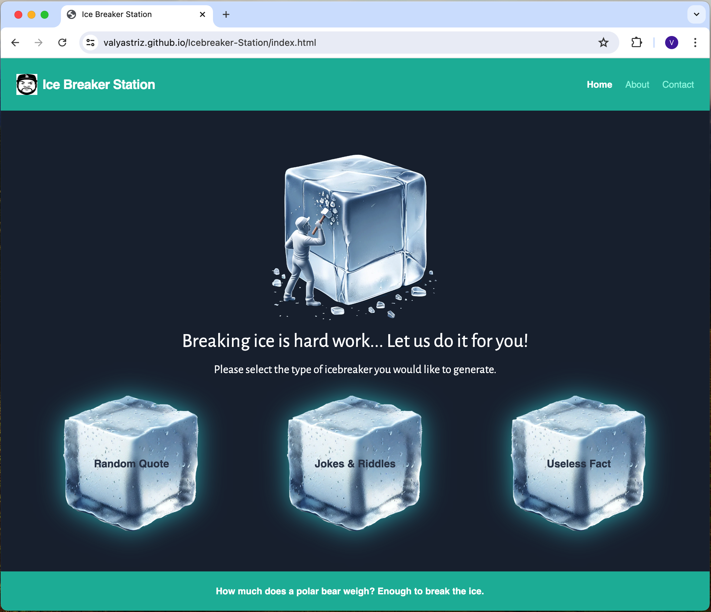
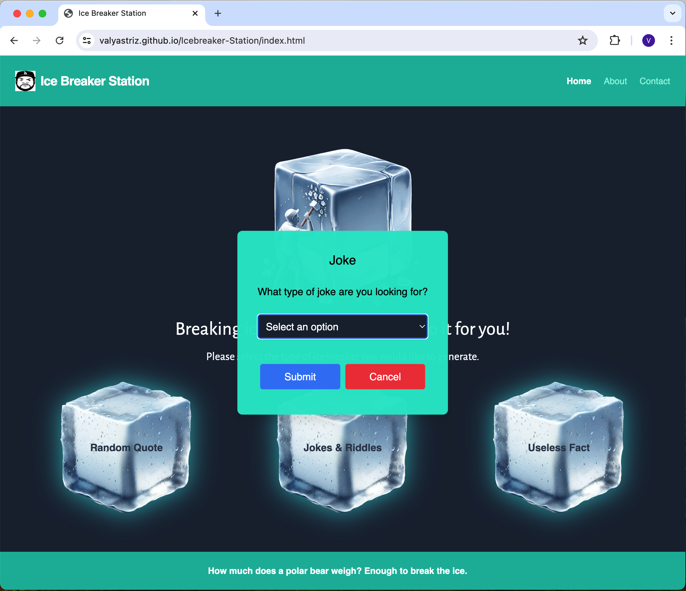
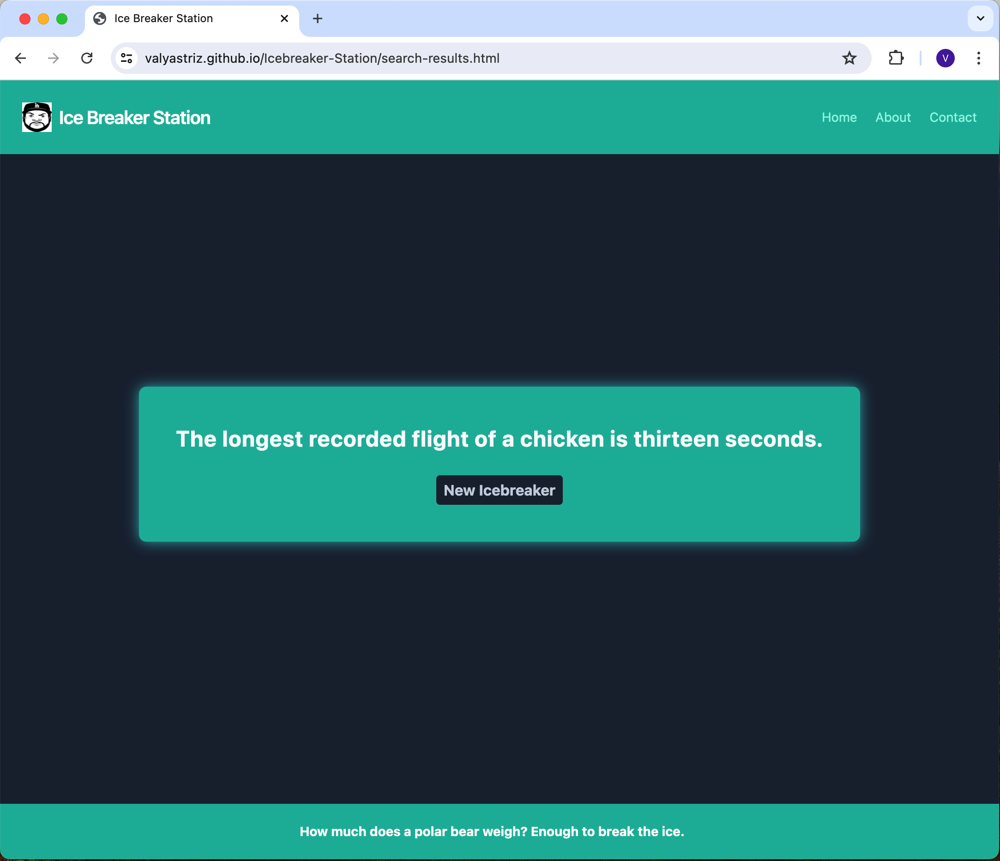
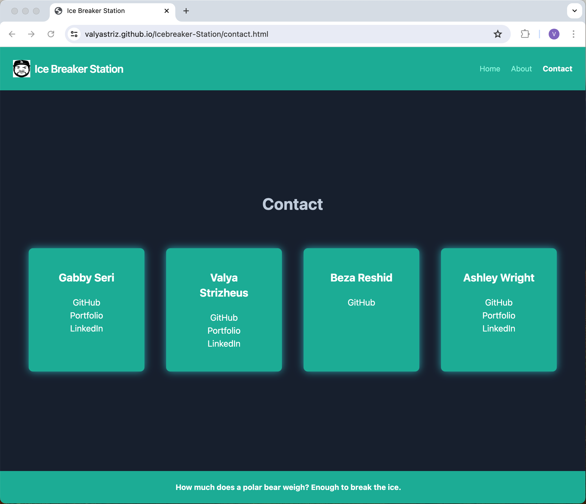
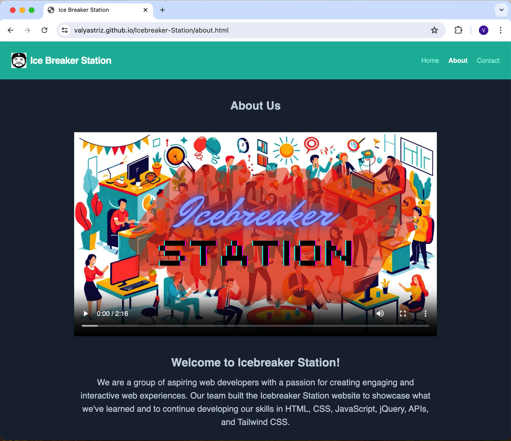

# Icebreaker-Station

## Description

Icebreaker Station is a web application designed to help users generate and share various types of icebreakers. This tool aims to facilitate social and professional interactions by providing engaging and fun icebreakers that can be easily shared with others.

### Motivation:

The motivation behind this project is to create a valuable tool that helps people start conversations and engage groups with interesting icebreakers.

### Purpose:

This project was built to provide users with a quick and easy way to generate different types of icebreakers and share them, enhancing social interactions.

### Problem Solved:

Icebreaker Station solves the problem of finding and generating engaging icebreakers quickly, making it easier for users to break the ice in social or professional settings.

### Learnings:

Through this project, we learned how to integrate multiple server-side APIs, implement client-side storage, ensure responsive design, and create a polished user interface using a Tailwind. We also learned how to work as a group on a coding project and how to resolve merge conflicts.

## Usage

Icebreaker Station allows users to generate different types of icebreakers quickly and easily. You can visit the depoloyed site here

## How to Use

-   Landing Page: The landing page features a clean and modern design with a header, responsive navigation menu, and icecube cards the user can select to render an icebreaker of their choice. It includes a welcome message and a brief description of the website’s purpose.

-   Results Page: The results page displays the generated icebreaker in a visually appealing text card. A “New Icebreaker” button is available for taking the user back to the home page where they can generate another icebreaker.

-   About Page: The About page showcases an engaging video accompanied by a custom song that narrates the story of our journey in creating the Icebreaker Website. It also highlights how the Icebreaker website can assist users in various scenarios.

-   Contact Page: The Contact Page features four interactive cards, each containing links to our GitHub, LinkedIn, and Portfolio pages, making it easy for users to connect with us.

## Cloning the Repository

To clone the repository and use it locally, follow these steps:

1. Open your terminal or command prompt.
2. Run the following command to clone the repository:

    ```sh
    git clone https://github.com/valyastriz/Icebreaker-Station.git
    ```

3. Navigate to the cloned repository:

    ```sh
    cd Icebreaker-Station
    ```

4. Open the `index.html` file in your preferred web browser to view the website locally.

## Visiting the Deployed Site

You can also visit the deployed site directly by clicking on the following URL:

[https://valyastriz.github.io/Icebreaker-Station/](https://valyastriz.github.io/Icebreaker-Station/)


## Screenshots
### Home Page


### Modal


### Results Page


### Contact Page


### About Page



## Credits

This project was created by a group of four team members as part of the OSU Bootcamp.

- [Valya Strizheus](https://github.com/valyastriz)
- [Ashley Wright](https://github.com/ajwmp93)
- [Bezawit Reshid](https://github.com/bezaosu)
- [Gabrielle Seri](https://github.com/DevGS23)

We used the following third-party assets:

- [Tailwind Framework](https://tailwindcss.com/)
- [API for Random Jokes](https://official-joke-api.appspot.com/random_joke)
- [API for Dad Jokes](https://api-ninjas.com/api/dadjokes)
- [API for Quotes](https://docs.quotable.io/)
- [API for Riddles](https://api-ninjas.com/api/riddles)
- [API for Useless Facts](https://uselessfacts.jsph.pl/random)

## Features

-   Generate different types of icebreakers including Random Quotes, Useless Facts, Dad Jokes, Random Jokes and Riddles.
-   Responsive design supporting different screen sizes
-   Client-side storage for saving generated icebreakers and displaying to the results screen.


